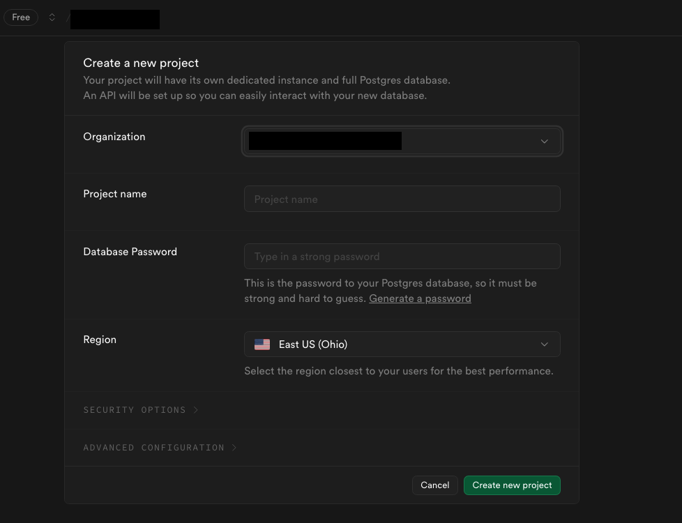
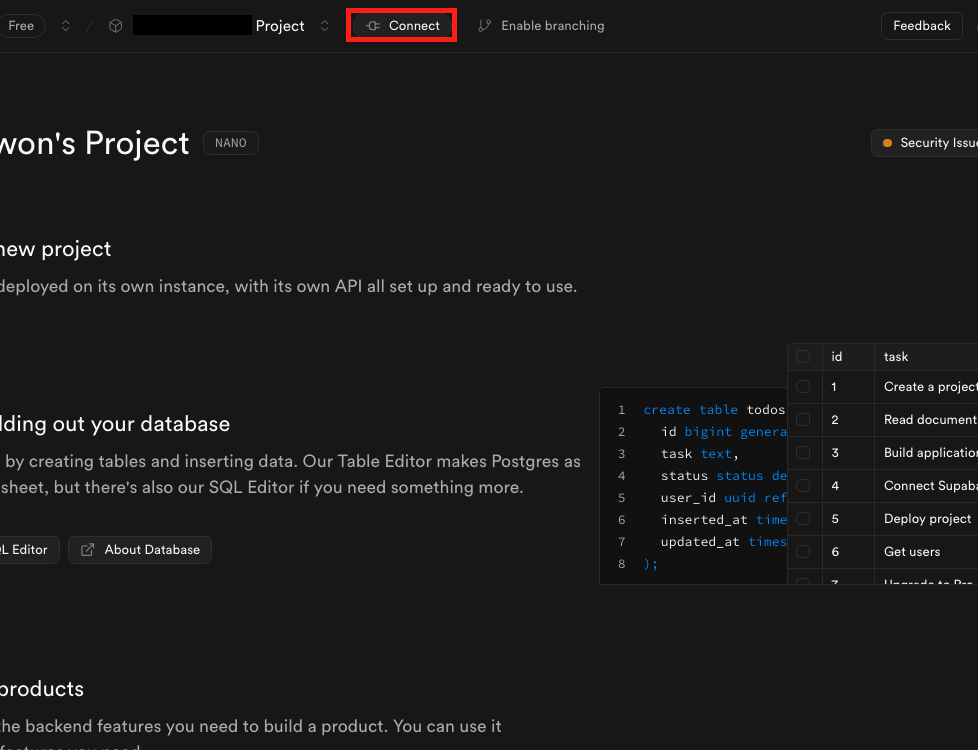
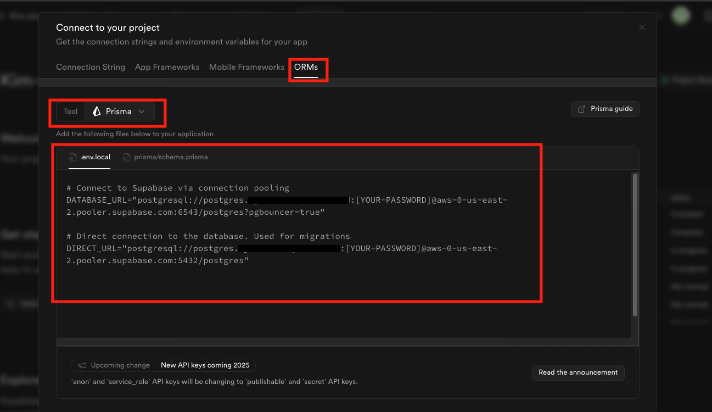

# Supabase + prisma(Typescript ORM) 무료 DB서버 세팅하기

진행 환경
- NextJS WebApplication
- Postgres
- CloudFlare Page Hosting

## SupaBase Project 생성 + Connection 정보 조회

1. SupaBase 프로젝트 생성


<br/>

2. DB connection 정보 조회




## NextJS Prisma 환경 설정

<strong>Prisma 의존성 설치</strong>
```bash
npm install prisma --save-dev
npm install @prisma/client

## prisma 기본 설정 파일 추가 (.env, prisma/schema.prisma)
npx prisma init
```

<strong>DB Connection 정보 입력</strong>
```text
# .env
`DB connection 정보 조회` 에서 조회된 .env.local 설정 Copy & Paste
```
```text
# ./prisma/schema.prisma
generator client {
  provider = "prisma-client-js"

  // generated 기본 파일 경로
  output   = "../src/shared/libs/generated/prisma"
}

datasource db {
  provider  = "postgresql"
  url       = env("DATABASE_URL")
  directUrl = env("DIRECT_URL")
}

# DB 테이블 Model 정의
model Post {
  post_id          BigInt   @id @default(autoincrement())
  title            String
  markdown_content String
  created_at       DateTime @default(now())
  
  @@map("post") // 실제 DB 테이블명이 post임을 명시
}

```

```bash
# 기본 prisma 설정 파일 생성
npx prisma generate
```


## Prisma Client 생성
```typescript
import { PrismaClient } from '@/shared/libs/generated/prisma';

const globalForPrisma = global as unknown as { prisma: PrismaClient };

const prisma =
  globalForPrisma.prisma ||
  new PrismaClient();

if (process.env.NODE_ENV !== 'production') globalForPrisma.prisma = prisma;

export default prisma;
```